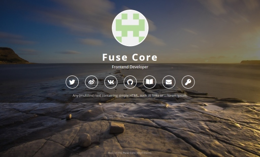
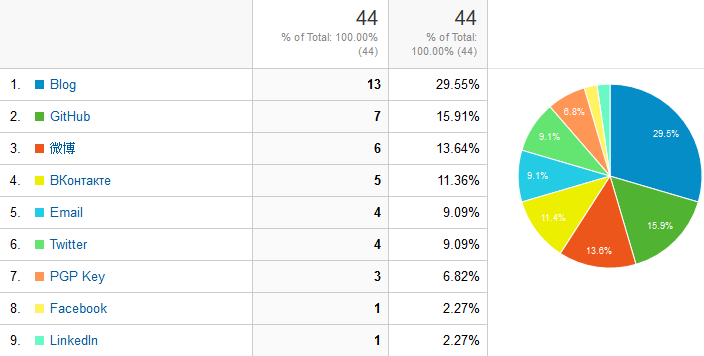

[DEMO](https://tsjensen.github.io/fuse-core/)

# Fuse Core

**A lightweight Jekyll theme for single-page personal websites.**

[](https://tsjensen.github.io/fuse-core/)

This [Jekyll](https://jekyllrb.com/) theme is for you if you need a personal website that simply
summarizes the links to your social media profiles and external content.

- *responsive* - adapts to all screen sizes
- *mobile-friendly*
- *lightweight* - no JavaScript (except for Google Analytics, if enabled)
- *easy to configure* - no HTML knowledge required, just change *_config.yml* ([step-by-step guide](https://github.com/tsjensen/fuse-core/wiki/Setup-Instructions))
- *fast* - All third party components loaded via their CDN (with
  [subresource integrity](https://developer.mozilla.org/en-US/docs/Web/Security/Subresource_Integrity)),
  so most resources are already cached from visits to other websites.
- Optional Google Analytics support, with IP anonymization and cookie consent popup
  (optional, but these things are helpful to comply with EU data protection laws).
  You'll need to have a Google Analytics account set up for this to work, of course.  
  We even generate statistics on how often people click on your specific social media links, for example:  
  


## Performance Hint

It is a good idea to increase the cache lifetime of the background image, so that public proxies and users' browsers
do not need to download it every time. GitHub Pages does not support cache control, but if *your* web server supports
`.htaccess` files, you may want to add one to the *images* folder like so:

```ApacheConf
# Cache the large background image for 1 year
<IfModule mod_headers.c>
    <Files "background.jpg">
        Header unset ETag
        Header set Cache-Control "public, max-age=31536000"
    </Files>
</IfModule>
```


## License

The *Fuse Core* theme is free to use and modify under the terms of the
[CC-BY-4.0](https://creativecommons.org/licenses/by/4.0/) license.

## Ancestry

The visual design for this theme is heavily inspired by [Dashingcode](https://github.com/dashingcode)'s
[front-cover](https://github.com/dashingcode/front-cover). Big thank you, it looks awesome!

However, *Fuse Core* is a complete reimplementation, which makes it very different on the inside.
There are many improvements big and small over front-cover, making *Fuse Core* a kind of "front-cover 2.0" or
"front-cover Plus":

- Complete configuration via *_config.yml*, including order of links or adding of new links.
- Ability to show extra HTML below the links, for any crisp statement that you deem necessary to add.
- Use of Bootstrap for responsive design. This gives us supreme browser compatibility and ease of maintenance,
  because a myriad of problems are already handled by the folks at Bootstrap.
- [SASS](https://sass-lang.com/) styling instead of raw CSS
- Up-to-date libraries, especially Font Awesome&nbsp;5.
- Support for [Google Analytics ](https://analytics.google.com/analytics/web/), including tracking of outbound links
  (so you'll know which social media profiles people clicked on), and some legal details such as IP anonymization
  and cookie consent popup (all optional).
- Search engine control via configurable meta tags
- Responsive sticky footer


## Credits

This theme draws upon the following work by others:

- Visual appearance from the [front-cover](https://github.com/dashingcode/front-cover) theme by Dashingcode under
  [MIT license](https://github.com/dashingcode/front-cover/blob/5fb173ed1b130a1414b8f839feea6d4e97cbd9b4/LICENSE).
- All icons are provided by [Font Awesome](https://fontawesome.com/) under
  [SIL OFL](https://fontawesome.com/license) license.  
  The [star icon](https://fontawesome.com/icons/star?style=solid) used as dummy favicon is provided
  by Font Awesome under [CC-BY-4.0](https://creativecommons.org/licenses/by/4.0/) license.
- The [background image](https://pxhere.com/en/photo/792989) is used under
  [CC0 Public Domain](https://creativecommons.org/publicdomain/zero/1.0/) license.
- The [Open Sans](https://fonts.google.com/specimen/Open+Sans) font by Steve Matteson is used under
  [Apache 2.0](http://www.apache.org/licenses/LICENSE-2.0) license.
- The [Bootstrap](https://getbootstrap.com/) framework is used under
  [MIT](https://github.com/twbs/bootstrap/blob/9c469cd0e8abaac19c163622ed68b6783dfa366c/LICENSE) license.
- The [dummy avatar image](images/avatar.svg) was generated using [TinyGraphs](http://www.tinygraphs.com/).
